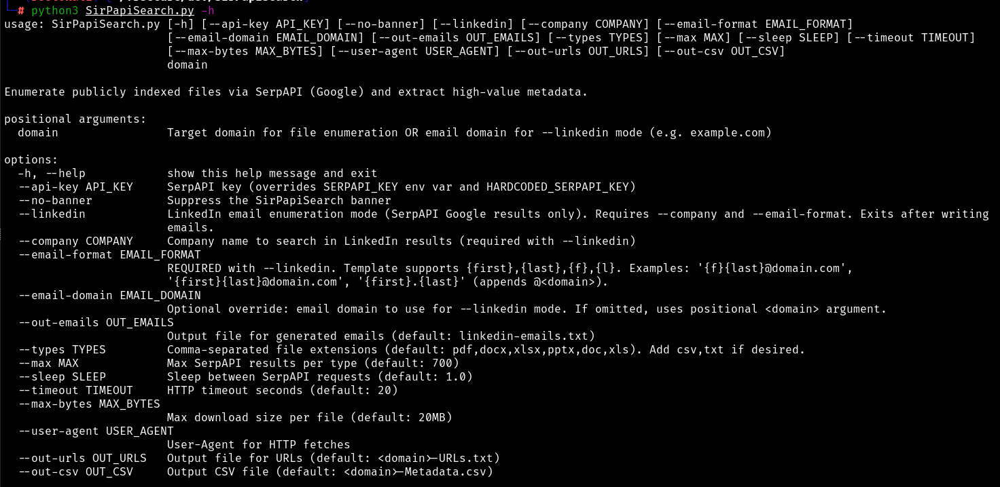
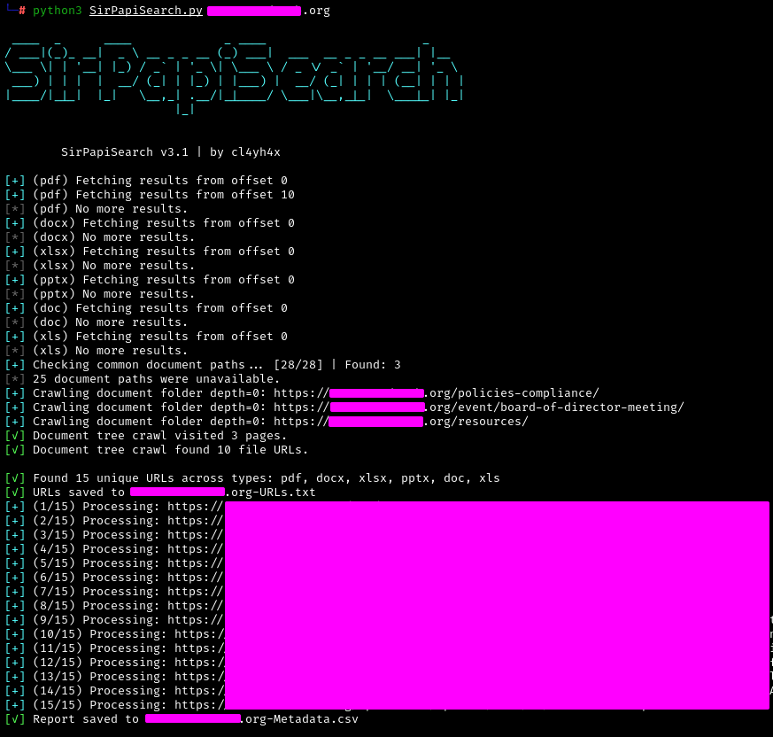
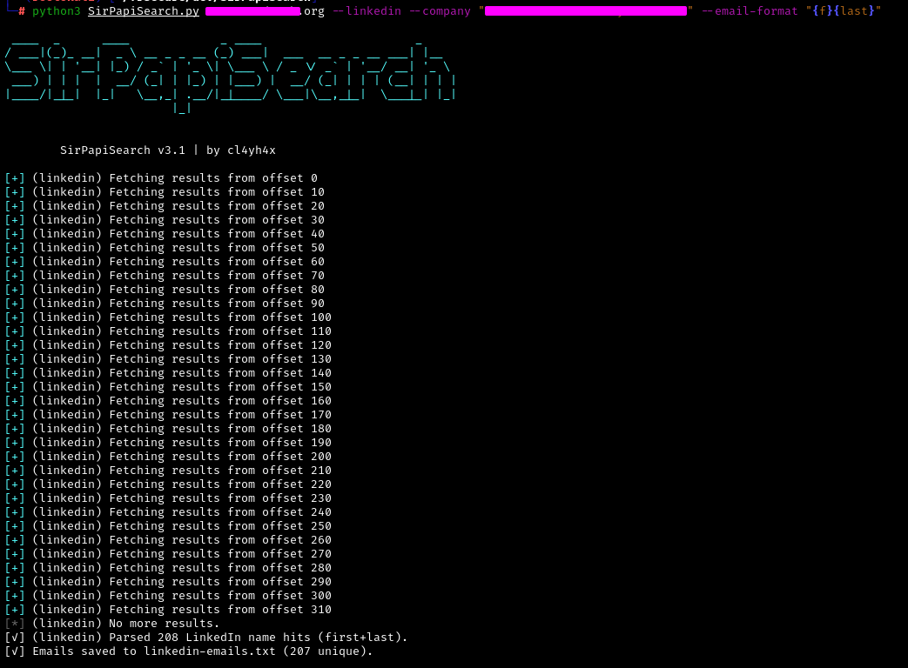

## Overview

SirPapiSearch is a SerpAPI-powered OSINT tool designed to automate:

- Public file enumeration from Google indexing and document portals
- Recursive discovery of multi-level CMS-backed document repositories
- Document metadata extraction without permanently saving files to disk
- LinkedIn-based name discovery and email pattern generation

Built specifically for **penetration testing and OSINT workflows**.

<p align="center">
  
</p>

---

## Features

### File Enumeration (Default Mode)

- Searches Google via SerpAPI using domain-based dorks
- Supports file types:
  - `pdf`, `docx`, `xlsx`, `pptx`, `doc`, `xls`, `txt`, `csv`
- Discovers common document repositories
- Recursively traverses multi-level document folders
- Extracts document links from HTML and embedded JSON routes
- Detects files hosted on common CMS/CDN platforms
- Extracts:
  - Author, Title, Creator, Producer
  - Application, Company, LastModifiedBy
  - Creation/Modification timestamps
  - Internal path indicators
  - File hashes (SHA256)
  - High-signal findings (emails, usernames, keywords)
- Streamed downloads (no disk writes)
- Outputs file URLs to `domain-URLs.txt` and extracted metadata to `domain-Metadata.csv` by default

<p align="center">
  
</p>

---

### LinkedIn Email Enumeration Mode

- Uses Google-indexed LinkedIn results (no scraping)
- Extracts **FirstName + LastName**
- Generates email formats

Supported placeholders:
- `{first}`, `{last}`, `{f}`, `{l}`

<p align="center">
  
</p>

---

## Installation

```bash
git clone https://github.com/clayhax/SirPapiSearch.git
cd SirPapiSearch
```
## API Key Configuration
* Register and grab your SerpAPI key https://serpapi.com/
* SirPapiSearch supports three methods (priority order):

  - `--api-key`
  - `SERPAPI_KEY` environment variable 
  - Hardcoded fallback in script

---

### Usage

## File Enumeration (Default)

```bash
python3 SirPapiSearch.py example.com
```
## LinkedIn Mode

```bash
python3 SirPapiSearch.py company.com --linkedin --company "Company Name" --email-format "{f}{last}"
```

---

## ⚠ Disclaimer

This tool is intended for **authorized security testing only**.

## 👤 Author

clayhax

---

Comments, suggestions, and improvements are always welcome. Be sure to follow @0xclayhax on Twitter for the latest updates.
